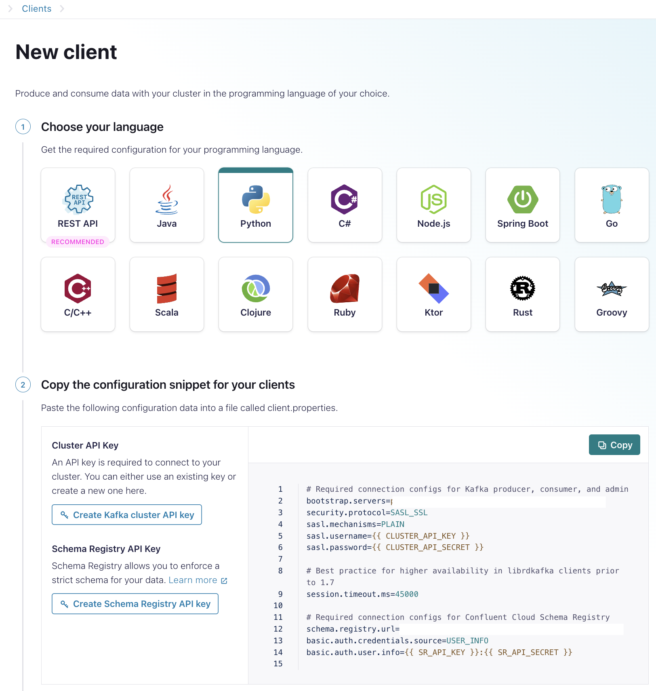
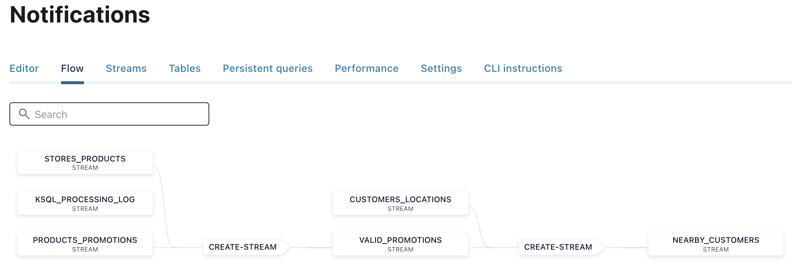
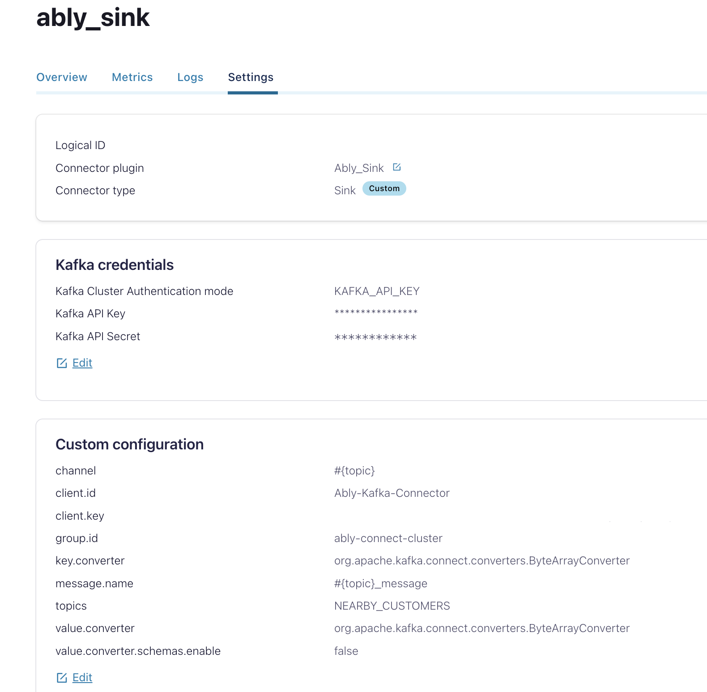

# In-Store-Personalization


<div align="center" padding=25px>
    
</div>

# Building Customer Engagement One Store at a Time


Customers today expect their shopping experiences to be ‘personalized’. They expect to be shown products suited to their exact needs and wants, at the right time, at a reasonable price. And while this expectation has been created by the innovation of online retailers (e.g. via in-session product recommendation engines and dynamic pricing), it’s increasingly being met by vendors with physical stores. 

Hybrid retailers (i.e. those with online and physical presences), in particular, are meeting customer demands by delivering “in-store personalization”. They’re leveraging technologies like Confluent and Ably to join and process disparate data sets (online, in-app, and offline), and provide customers with some form of ‘personalized’ experience while they’re in a physical store – this could be individually-targeted messaging or personalized offers, for example.  

In this demo, we’re going to guide you through one example of in-store personalization which involves advertising relevant discounts to customers via a mobile application while they’re browsing products in a physical store. The objective of this use case, which has been deployed by a number of Confluent customers, is to leverage customer data and geo-fencing in order to increase in-store conversion rates of digital promotions. 


## Architecture Diagram


<!--- Add one paragraph about the architecture that you are going to deploy for the use case -->

This is the high-level architecture we’ll be following for this use case. We’ll generate mock data using Python script to populate three topics in Confluent Cloud; one each for customer location, product location (in-store), and current promotions. 

We’ll then use stream processing to join disparate streams on customer locations and valid promotions, and create a new stream (“NEARBY_CUSTOMERS”), filtering customers who are 100 feet or less away from a particular product. Lastly, we’ll stream this data to Ably via the Ably Sink connector. Ably will then notify a customer via an app of current promotions relating to nearby products in-store. 


<div align="center"> 
     <!--- Replace the path with your arch image location -->
</div>


# Requirements

<!--- Add all the requirement that are needed for the demo. The below three mentioned are generally required for most of the use cases -->

In order to successfully complete this demo you need to install few tools before getting started.

- If you don't have a Confluent Cloud account, sign up for a free trial [here](https://www.confluent.io/confluent-cloud/tryfree).
- Install Confluent Cloud CLI by following the instructions [here](https://docs.confluent.io/confluent-cli/current/install.html).
- Please follow the instructions to install Terraform if it is not already installed on your system [here](https://developer.hashicorp.com/terraform/tutorials/aws-get-started/install-cli).
- This demo uses Python 3.9.13 version.
- This demo uses python modules. You can install the neccessary modules through the pip command.
 ```
  pip3 install [modulename]
  ```
  

## Prerequisites

<!--- Prerequisites for Confluent Cloud will remain same for most of the use cases. Just change the image location since Cloud API key is required for terraform script. -->

### Confluent Cloud 


1. Sign up for a Confluent Cloud account [here](https://www.confluent.io/get-started/).
2. After verifying your email address, access Confluent Cloud sign-in by navigating [here](https://confluent.cloud).
3. When provided with the _username_ and _password_ prompts, fill in your credentials.

   > **Note:** If you're logging in for the first time you will see a wizard that will walk you through the some tutorials. Minimize this as you will walk through these steps in this guide.

4. Create Confluent Cloud API keys by following the steps in UI. Click on the button that is present on the right top section and click on Cloud API Key.
<div align="center"> 
  
</div>

Now click Add Key to generate API keys and store it as we will be using that key in this demo.
<div align="center"> 
  
</div>
    
   > **Note:** This is different than Kafka cluster API keys. 

## Any External System Prerequistes


<!--- Add one or two sentence about the prerequistes -->


## Setup

1. This demo uses Terraform to spin up resources that are needed.


<!--- If you are using terraform you might needed the user to add the keys on the variables file so please add those below.I have shared a sample below -->

2. Update the `terraform/variables.tf` file for the following variables with your Cloud API credentials as well your DB details

```
variable "confluent_cloud_api_key" {
  
  default = " Replace with your API Key created during pre-requsite"   
}

variable "confluent_cloud_api_secret" {
  default = "Replace with your API Key created during pre-requsite"   
}
```
 ### Build your cloud infrastructure


<!--- This can be left as it is as it is common execution step for all the terraform script -->
1. Navigate to the repo's terraform directory.
   ```bash
   cd terraform
   ```

2. Initialize Terraform within the directory.
   ```
   terraform init
   ```

3. Apply the plan to create the infrastructure.

   ```
   terraform apply 
   ```

   > **Note:** Read the `main.tf` configuration file [to see what will be created](./terraform/main.tf).


 # Demo


## <header style="font-weight:normal">Execute Python Script to Generate Mock Source Data</header>

1. Please run the Python script located in the Python script folder. Before running it, make sure to replace the below mentioned configuration settings in the code to point to your Confluent Cloud cluster that you created.
    
```
BOOTSTRAP_SERVERS = ''  # Replace with your Confluent Cloud bootstrap servers
SASL_USERNAME = ''  # Replace with your Confluent Cloud API key
SASL_PASSWORD = ''  # Replace with your Confluent Cloud API secret
```
To obtain the following details, navigate to the Clients section on the Confluent Cloud UI and select Python as the script type. From there, you can copy the bootstrap server and API Key details and replace them in the code.

<div align="center"> 
  
</div>

Please run the Python script using the following syntax to get the necessary data into the required topics:

1. Topic: customers_locations
```
python3 produce_customer_location.py
```
1. Topic: products_promotions
```
python3 products_promotions.py
```
1. Topic: stores_products
```
python3 generate_store_data.py
```
## <header style="font-weight:normal">Generating Valid Promotions based on Proximity to In-Store Products using ksqlDB</header>

<!--- Add all the KSQLDB queries that are reqiured. Below is one sample. Will include Flink here as well after GA. -->

We’ll leverage the “geo_distance” function for simple distance-from-location calculation. However, in advanced use-cases this could be done with a UDF or a Kafka Streams app.

Logic: if customer within 100 feet radius of product that matches a segment in the promotions topic, emit an event with product info and discount.


1. Create a ksqlDB stream from `stores_products` topic.


 ```SQL
 CREATE STREAM stores_products (
  SKU BIGINT,
  segment VARCHAR, variant VARCHAR,
  latitude DECIMAL(10,5), longitude DECIMAL(10,5),
  country VARCHAR
  
  ) WITH (
    KAFKA_TOPIC = 'stores_products',
    VALUE_FORMAT = 'JSON'
  );
 ```

2.  Create a ksqlDB stream from `customers_locations` topic.
```SQL
CREATE STREAM customers_locations (
  uid VARCHAR,
  latitude DECIMAL(10,5),
  longitude DECIMAL(10,5),
  country VARCHAR
  
  ) WITH (
    KAFKA_TOPIC = 'customers_locations',
    VALUE_FORMAT = 'JSON'
  );
 ```
3. Create a ksqlDB stream from `products_promotions` topic.

```SQL
CREATE STREAM products_promotions (
  pid VARCHAR,
  SKU BIGINT,
  segment VARCHAR 
  ) WITH (
    KAFKA_TOPIC = 'products_promotions',
    VALUE_FORMAT = 'JSON'
  );
```

4. Create a ksqlDB Stream joining `stores_products` and `products_promotions` streams to fetch `VALID_PROMOTIONS`
```SQL
CREATE STREAM VALID_PROMOTIONS WITH (KAFKA_TOPIC='VALID_PROMOTIONS')  AS 
SELECT
S.LATITUDE,S.LONGITUDE,S.COUNTRY,S.SEGMENT,
P.PID,P.SEGMENT
FROM STORES_PRODUCTS S JOIN PRODUCTS_PROMOTIONS P WITHIN 1 HOUR
ON S.SEGMENT = P.SEGMENT 
EMIT CHANGES;
```
1. Create a ksqlDB Stream `NEARBY_CUSTOMERS` to genrate the Geo-distance between the customer and the store location and filter the nearby customers.

```SQL
CREATE STREAM NEARBY_CUSTOMERS WITH (KAFKA_TOPIC='NEARBY_CUSTOMERS') AS
SELECT
C.LATITUDE,C.LONGITUDE,C.COUNTRY,P.PID,
(geo_distance(C.LATITUDE, C.LONGITUDE, P.LATITUDE, P.LONGITUDE, 'km') * 3281) AS dist_to_store
FROM CUSTOMERS_LOCATIONS C JOIN VALID_PROMOTIONS P WITHIN 30 MINUTES
ON C.COUNTRY = P.COUNTRY 
WHERE dist_to_store <= 100
EMIT CHANGES;
```
You should be able to see the flow in ksqlDB like so:
      <div align="center"> 
        
      </div>

# <header style="font-weight:normal">Connect Ably Sink Connector to Confluent Cloud</header>
1. Grab the Connector from the [Ably repository](https://github.com/ably/kafka-connect-ably#confluent-cloud-custom-connector).
2. Go to Connectors, select “Add Connector,” then “Add Plugin.” Follow the instructions in the repo to install the connector.
      <div align="center"> 
        
      </div>
3. Set it to read from the `NEARBY_CUSTOMERS` topic. 
4. Refer to the Ably Configs File in this repositry to configure the connector.
   <div align="center"> 
        
      </div>
5. Configure two channels within Ably: Location and Promotions.
6. Configure an Ably Firehose connection back to Kafka. (optional) 


## Congratulations

Congratulations on building an in-store personalisation streaming application in Confluent Cloud! 


## Confluent Cloud Stream Governance

Confluent offers data governance tools such as Stream Quality, Stream Catalog, and Stream Lineage in a package called Stream Governance. These features ensure your data is high quality, observable and discoverable. Learn more about **Stream Governance** [here](https://www.confluent.io/product/stream-governance/) and refer to the [docs](https://docs.confluent.io/cloud/current/stream-governance/overview.html) page for detailed information.

1.  Navigate to https://confluent.cloud
1.  Use the left hand-side menu and click on **Stream Lineage**.
    Stream lineage provides a graphical UI of the end to end flow of your data. Both from the a bird’s eye view and drill-down magnification for answering questions like:

    - Where did data come from?
    - Where is it going?
    - Where, when, and how was it transformed?

In our use case, the stream lineage appears as follows: we utilize a Python script to generate events that are sent to the 3 topics. Then we use KSQLDB to create streams for calculating valid in-store promotions and identifying customers who are close to promoted products. 


<div align="center"> 
  
</div>
   

# Teardown

You want to delete any resources that were created during the demo so you don't incur additional charges.
1. Pause the Python scripts in the background on your localhost
2. Pause and then delete the Ably Sink Connector from the Confluent Cloud UI
3. Run the following command to delete all resources created by Terraform
   ```bash
       terraform apply -destroy


   
   
# References
<!--- Add links to relevant docs, product webpages, etc. Here are a few examples. -->
1. Ably Sink Connector (BYOC) - [doc](https://github.com/ably/kafka-connect-ably#confluent-cloud-byoc)
2. Custom Connectors for Confluent Cloud [doc](https://docs.confluent.io/cloud/current/connectors/bring-your-connector/custom-connector-qs.html#cc-bring-your-connector-qs)
3. ksqlDB [page](https://www.confluent.io/product/ksqldb/) and [use cases](https://developer.confluent.io/tutorials/#explore-top-use-cases)
4. Stream Governance [page](https://www.confluent.io/product/stream-governance/) and [doc](https://docs.confluent.io/cloud/current/stream-governance/overview.html)


  
